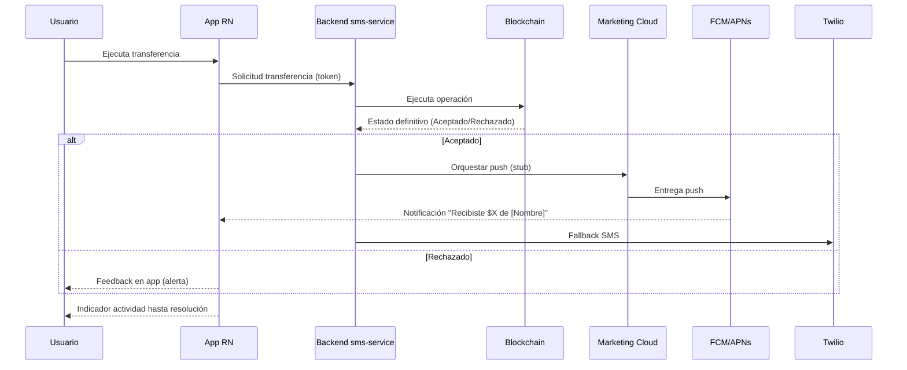
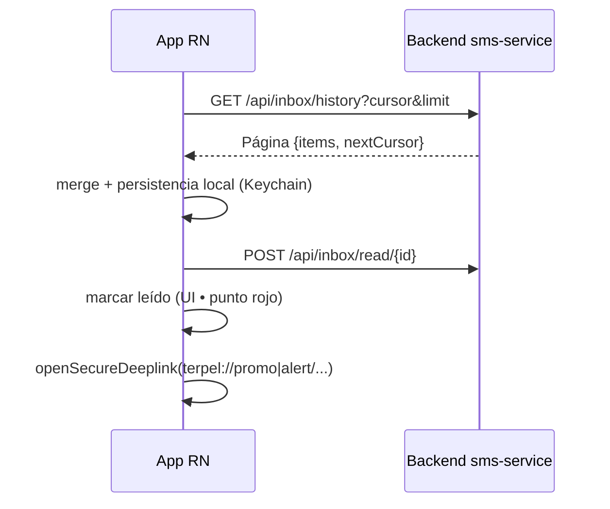

# Documentación End-to-End — TerpelPoC-TRAE

Repositorio de PoC para notificaciones de transferencia y centro de notificaciones (Inbox). Arquitectura híbrida React Native (Android/iOS) + Spring Boot (`sms-service`). Implementa HU-01 (push/SMS transaccional) y HU-02 (Inbox con paginación y "No leído").

## Visión General
- Confianza del usuario mediante confirmación inmediata de transacciones
- Recuperación de mensajes en Inbox con deep links seguros
- Base para orquestación futura (Marketing Cloud)

## Arquitectura
```mermaid
flowchart TD
  A[App React Native] --> B[APIGee / Gateway]
  B --> C[Orquestador de Notificaciones (futuro)]
  C --> D[Marketing Cloud]
  D --> E[FCM/APNs]
  E --> A
  C --> F[In-App Inbox]
  B --> G[Microservicio sms-service]
  G --> H[Twilio (SMS)]
  G --> I[Historial Inbox]
  subgraph Backend
    G
  end
  subgraph Proveedores
    H
    D
    E
  end
```

## HU-01: Confirmación de Recepción (Flujo)


## HU-02: Historial de Mensajes (Flujo)


## API Backend
- `POST /api/notify/transfer` → 200 solo si `status="Aceptado"`
- `POST /api/sms/transfer` → 200 solo si `status="Aceptado"`
- `POST /api/sms/payment`, `POST /api/sms/security`
- `GET /api/inbox/history?limit=20&cursor=<id>`
- `POST /api/inbox/read/{id}`

## Frontend (Ubicaciones Clave)
- `src/screens/MiBolsillo.tsx`: indicador "Procesando", bifurcación Aceptado/Rechazado, envío push/SMS
- `src/screens/InboxScreen.tsx`: FlatList cronológica, "No leído", infinite scroll, deep links
- `src/services/inbox.ts`: fetch/merge/persistencia, `openSecureDeeplink`
- `src/services/sms.ts`: llamadas a `notify/sms`

## Configuración
- Twilio: `twilio.accountSid`, `twilio.authToken`, `twilio.fromNumber` (no subir secretos)
- Base URLs RN: Android `http://10.0.2.2:8080`, iOS `http://localhost:8080`
- Si Twilio no está configurado, el backend evita llamar API (entorno de prueba)

## Pruebas
- Backend (JUnit/Maven): `mvn -q -f backend/sms-service/pom.xml test`
- Frontend Unit (Jest): `npm test` (requiere instalación de dependencias)
- Lint: `npm run lint`
- E2E (Appium/WebdriverIO):
  - Android: `npm run e2e:android`
  - iOS: `npm run e2e:ios`

## Seguridad
- Validación de deep links (`terpel://promo|alert/<id>`)
- Sin exposición de credenciales en repositorio
- Autenticación por token vía gateway (pendiente de integración)

## KPIs
- Entrega push/SMS promedio < 5 s, éxito > 98%
- CTR deeplinks transaccionales > 35%
- -30% tickets "¿pasó mi pago?"

## Rama de trabajo
- `feature/notificaciones-transferencia` con pruebas backend en verde

